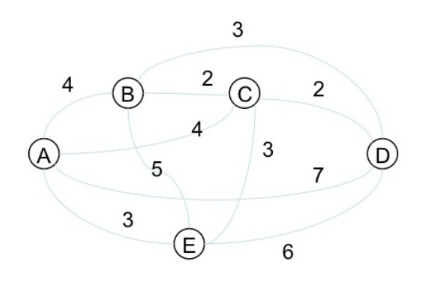
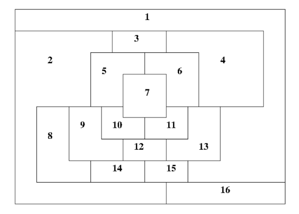

# Θέμα προαιρετικής εργασίας για το μάθημα «Τεχνητή Νοημοσύνη και Έμπειρα Συστήματα».

## Η εργασία είναι ατομική. Επιλέξτε ένα από τα παρακάτω θέματα:

Α. Αναπτύξτε πρόγραμμα επίλυσης του Traveling Salesman Problem με χρήση γενετικών αλγορίθμων και γλώσσα προγραμματισμού της επιλογής σας. Ο γράφος αποτελείται από πλήρως διασυνδεδεμένες πόλεις όπως φαίνεται στo παρακάτω σχήμα.

Β. Αναπτύξτε πρόγραμμα χρωματισμού του παρακάτω γράφου με χρήση γενετικών αλγορίθμων και γλώσσα προγραμματισμού της επιλογής σας. Τα διαθέσιμα χρώματα είναι 4: μπλε, κόκκινο, πράσινο, κίτρινο.

### Χρησιμοποιήστε τυχαίο αρχικό πληθυσμό με πλήθος της δικής σας επιλογής. Χρησιμοποιείστε συνάρτηση καταλληλότητας και διαδικασία επιλογής γονέων σας της δικής σας επιλογής, επίσης. Χρησιμοποιείστε αναπαραγωγή με διασταύρωση ενός σημείου. Επιλέξτε αν θέλετε να κάνετε και μερική ανανέωση πληθυσμού σε κάποιο ποσοστό π.χ. 30% και μετάλλαξη ενός ψηφίου π.χ. στο 10% του πληθυσμού. Παραδοτέα της εργασίας είναι μία σύντομη αναφορά που να περιλαμβάνει τον τρόπο δράσης του υπολογιστή σύμφωνα με τον αλγόριθμο επίλυσης και παραδείγματα εκτέλεσης του προγράμματος που αναπτύξατε.
